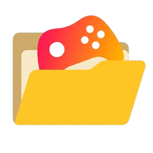

# AutoImport

<div align="center">



**A Playnite library plugin that automatically scans your folders for game executables**

[](extension.yaml)
[](https://playnite.link)

</div>

---

## 📖 Overview

AutoImport is a Playnite library plugin that helps you discover and import games from your local folders. Simply configure the folders you want to scan, and AutoImport will find all game executables, allowing you to selectively import them into your Playnite library.

### ✨ Features

- 🔍 **Automatic Game Detection** - Scans specified folders and subfolders for game executables
- 🎯 **Smart Filtering** - Automatically filters out setup files, uninstallers, and other non-game executables
- 📁 **Folder-Based Naming** - Uses folder names for game titles when available, falling back to executable names
- 🚫 **Block List** - Ignore specific files from future scans

---

## 📦 Installation

1. **Download the latest release** from the [Releases](https://github.com/Neppale/AutoImport/releases) page
2. **Extract the ZIP file** to get the `AutoImport` folder
3. **Copy the entire folder** to your Playnite extensions directory:
   - **Desktop Mode**: `%AppData%\Playnite\Extensions\`
   - **Portable Installation**: `<PlayniteInstallPath>\Extensions\`
4. **Restart Playnite**

---

## 🚀 How to Use

### Initial Setup

1. **Open Playnite Extensions settings**

   - Go to `Extensions` → `Extension settings` → `Libraries` → `AutoImport`

2. **Configure Scan Folders**

   - Click on AutoImport to open its settings
   - In the first field, add the folders you want to scan. Example:

     ```
     C:\Games
     D:\SteamLibrary\steamapps\common
     E:\GOG Games
     ```

3. **Save Settings**

### Scanning for Games

AutoImport will automatically scan when starting Playnite. If you want to scan manually, you can do so by clicking `Reload games list` → `AutoImport` in the main menu.

### Selecting Games to Import

1. When AutoImport finds games, a **selection window** will appear
2. **Check the boxes** next to the games you want to import or ignore
3. Click **Import** to import or ignore the selected games
4. Click **Cancel** to skip importing or ignoring this time

### Managing Blocked Games

Games you ignore during selection are automatically added to the block list. You can manually remove games from the block list in the plugin settings. Blocked games won't appear in future scans.

---

## ⚙️ How It Works

### Scanning Process

1. **Folder Scanning**

   - AutoImport scans the root folder and immediate subfolders
   - It looks for all `.exe` files in these directories

2. **Game Detection**

   - Filters out common non-game executables:
     - Setup/Installer files
     - Uninstaller files
     - Configuration tools
     - Crash handlers

3. **Duplicate Detection**

   - Compares found games against your existing Playnite library
   - Skips games that are already imported

4. **Name Extraction**

   - **Primary**: Uses the folder name (cleaned and formatted)
   - **Fallback**: Uses the executable filename if folder name is generic
   - Removes version numbers, tags, and other metadata from names

5. **User Selection**
   - Presents all found games in a selection interface
   - Allows you to choose which games to import

### Smart Name Cleaning

AutoImport automatically cleans game names by:

- Removing version numbers (e.g., "v1.2.3")
- Removing tags in brackets or parentheses
- Removing common suffixes (repack, GOTY, edition, etc.)
- Converting underscores and dots to spaces
- Normalizing whitespace

---

## 📝 Configuration Options

### Scan Folders

- **Purpose**: Define which folders to scan for games
- **Format**: One folder per line, or comma-separated
- **Example**: `C:\Games, D:\My Games`

### Blocked Paths

- **Purpose**: List of games/folders to ignore
- **Auto-populated**: When you ignore games during selection
- **Manual management**: Remove items from the list in settings

---

## 📄 License

This project is licensed under the MIT License. See the [LICENSE](LICENSE.md) file for details.
